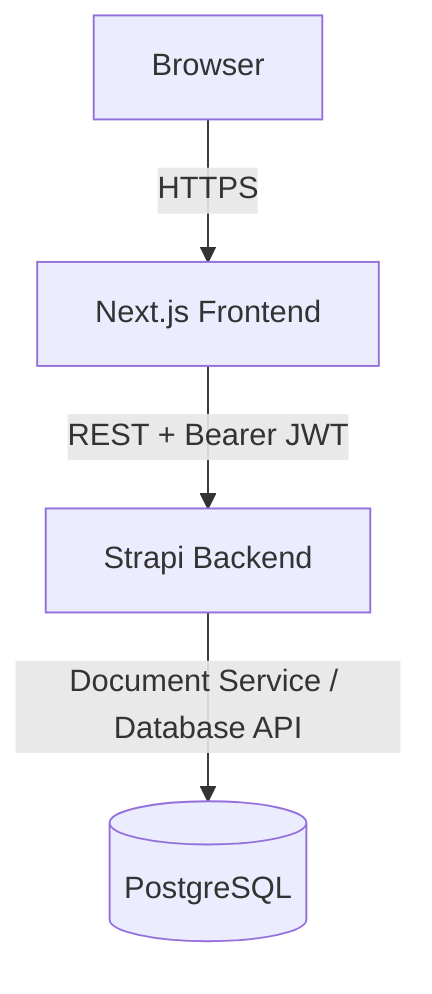

# CPS Academy

A full-stack Learning Management System with role-based course authoring, sequential lesson progression, server-graded quizzes, and a blog draft/publish workflow. Built as a Junior Software Engineer hiring assignment.


## Table of Contents

- [Overview](#overview)
- [Live Application](#live-application)
- [Tech Stack](#tech-stack)
- [Roles and Permissions](#roles-and-permissions)
- [Core Features](#core-features)
- [Security Design](#security-design)
- [Architecture](#architecture)
- [Project Structure](#project-structure)
- [Getting Started](#getting-started)
- [Environment Variables](#environment-variables)
- [Verification](#verification)
- [API Reference](#api-reference)
- [Deployment](#deployment)
- [Design Principles](#design-principles)
- [Author](#author)

## Overview

CPS Academy supports role-based course authoring, student enrollment, sequential lesson progression, persistent progress tracking, server-authoritative quiz grading, application user management, and a blog draft-and-publish workflow.

Every authorization decision, grading calculation, and progress value is computed on the backend. The frontend only presents state and improves the user experience, never becomes the source of truth for anything that matters.

## Live Application

| Environment  | URL                                               |
| ------------ | -------------------------------------------------- |
| Frontend     | https://cps-academy.vercel.app                     |
| Backend API  | https://backend-production-6651f.up.railway.app    |

The frontend is deployed on Vercel. The Strapi backend and PostgreSQL database are deployed on Railway.

## Tech Stack

| Layer              | Technology                          |
| ------------------ | ------------------------------------ |
| Frontend framework | Next.js 16 (App Router)              |
| UI library          | React 19                             |
| Language            | TypeScript                           |
| Styling             | Tailwind CSS                         |
| Backend framework   | Strapi 5                             |
| Backend language    | TypeScript                           |
| Authentication      | Strapi Users & Permissions plugin    |
| Database            | PostgreSQL                           |
| Frontend hosting    | Vercel                               |
| Backend hosting     | Railway                              |
| Database hosting    | Railway PostgreSQL                   |

## Roles and Permissions

CPS Academy has four application roles: **Admin**, **Content Manager**, **Instructor**, and **Student**. Registration creates a Student account by default.

| Capability                          | Admin      | Content Manager | Instructor      | Student |
| ------------------------------------ | ---------- | ---------------- | ---------------- | ------- |
| View platform statistics             | ✅         |                   |                   |         |
| View and manage application users    | ✅         |                   |                   |         |
| Manage courses                       | ✅ (all)   | ✅ (all)          | ✅ (own only)     |         |
| Assign instructors to courses        | ✅         | ✅                |                   |         |
| Manage lessons and quizzes           | ✅ (all)   | ✅ (all)          | ✅ (own courses)  |         |
| View student progress                | ✅ (all)   | ✅ (all)          | ✅ (own courses)  | ✅ (self) |
| Manage blog posts                    | ✅ (all)   | ✅ (own)          |                   |         |
| Browse catalog and enroll            |            |                   |                   | ✅      |
| Complete lessons and take quizzes    |            |                   |                   | ✅      |

Instructor ownership is enforced by the backend, not the UI. A Strapi Super Admin account is a separate, infrastructure-level concept from a CPS Academy LMS Admin user.

## Core Features

### Authentication and RBAC

Authentication uses Strapi Users & Permissions. After login, the frontend stores the JWT in `sessionStorage` and sends it via the `Authorization: Bearer` header. `GET /api/me` returns the authenticated identity and LMS role, and is the single source of truth the frontend relies on. Frontend route guards exist for user experience only — authorization is always enforced by the backend.

### Course Management

Admin and Content Manager can manage all courses. Instructors can manage only the courses assigned to them. A course contains ordered lessons and one or more quizzes, and both ownership and course relationships are controlled server-side.

### Sequential Learning

Lessons carry a positive integer `order`. A student must complete lower-order lessons before a later lesson becomes accessible, and this sequence is enforced on the backend so a student cannot complete a locked lesson directly through the API.

### Persistent Progress

Completing a lesson creates a Lesson Progress record. Course progress is calculated on the backend as:

```text
completed lessons / total lessons × 100
```

The frontend displays this server-calculated value rather than computing its own. A course with no lessons reports zero progress.

### Quiz System

Quiz questions use stable question and option keys, and the student-facing quiz API never exposes the correct answer key. A submission looks like this:

```json
{
  "answers": [
    {
      "questionKey": "question-key",
      "selectedOptionKey": "option-key"
    }
  ]
}
```

On submission, the backend loads the authoritative quiz, compares the submitted option keys against the correct answer keys, calculates the score, stores the result, and stores an answer snapshot for historical consistency. Students can attempt a quiz multiple times and review past results.

### Student Progress Reporting

Admin and Content Manager can view student progress across managed courses. Instructors are limited to their own courses, and students can only see their own progress.

### Admin Dashboard

The Admin dashboard shows total application users, total courses, total enrollments, and user counts by LMS role, and supports role management. Changing a user's role immediately affects the platform statistics. The backend also protects key invariants, such as blocking removal of the last remaining LMS Admin.

### Blog Publishing Workflow

Admin and Content Manager can create blog posts, which support Draft and Published states. Public blog endpoints expose only published content. Content Managers can manage only the posts they authored; Admin can manage all of them.

## Security Design

The backend treats all client-supplied data as untrusted:

- Student identity comes from the authenticated JWT, not from client input.
- Clients cannot enroll another student or supply their own course progress.
- Correct quiz answers are never returned by student-facing endpoints, and scores are always calculated server-side.
- Instructor course ownership and lesson sequencing are enforced server-side.
- Sensitive user fields are excluded from public responses.
- Public course endpoints return only catalog and syllabus information intended to be public.
- The application Admin role and the Strapi Super Admin account are kept separate.

These responsibilities map to a single owner each:

| Concern              | Owned by                          |
| --------------------- | ----------------------------------- |
| Authentication         | Strapi Users & Permissions         |
| Role authorization     | Backend                            |
| Instructor ownership   | Backend                            |
| Student identity       | Authenticated JWT                  |
| Enrollment identity    | Backend                            |
| Lesson sequencing      | Backend                            |
| Course progress        | Backend                            |
| Quiz grading           | Backend                            |
| Quiz history           | PostgreSQL                         |
| Blog ownership         | Backend                            |
| Role statistics        | Backend                            |

The frontend never substitutes for these boundaries.

## Architecture



The browser talks to the Strapi REST API directly. The frontend handles presentation, local interaction state, and UX-level route guards. Strapi owns authentication, authorization, validation, business rules, grading, progress calculation, and persistence.

## Project Structure

```text
cps_academy/
├── backend/
│   ├── config/
│   ├── src/
│   │   ├── api/
│   │   ├── components/
│   │   └── utils/
│   ├── package.json
│   └── tsconfig.json
│
├── frontend/
│   ├── src/
│   │   ├── app/
│   │   ├── components/
│   │   ├── features/
│   │   └── lib/
│   ├── tests/
│   ├── package.json
│   └── tsconfig.json
│
└── README.md
```

The frontend uses a feature-oriented structure so authentication, courses, learning, quizzes, administration, and blog management stay separated.

## Getting Started

### Prerequisites

- Node.js 20 or newer
- npm
- PostgreSQL

Clone the repository, then install backend and frontend dependencies separately.

### Backend Setup

```bash
cd backend
npm ci
```

Create `backend/.env` (see [Environment Variables](#environment-variables) for the full list), then start Strapi:

```bash
npm run develop
```

The API runs on port `1337` by default. On first install, create the Strapi Super Admin account through the Strapi Admin interface — this is an operator account, separate from a CPS Academy LMS Admin user.

### Frontend Setup

```bash
cd frontend
npm ci
cp .env.example .env.local
npm run dev
```

The app runs on port `3000` by default.

## Environment Variables

### Backend (`backend/.env`)

| Variable              | Example                        | Notes                                   |
| ----------------------- | --------------------------------- | ------------------------------------------ |
| `HOST`                  | `0.0.0.0`                          |                                              |
| `PORT`                  | `1337`                             |                                              |
| `APP_KEYS`              | `replace-with-secure-development-keys` | Generate a secure value, do not reuse production keys |
| `API_TOKEN_SALT`        | `replace-with-a-secure-value`      | Generate a secure value |
| `ADMIN_JWT_SECRET`      | `replace-with-a-secure-value`      | Generate a secure value |
| `TRANSFER_TOKEN_SALT`   | `replace-with-a-secure-value`      | Generate a secure value |
| `ENCRYPTION_KEY`        | `replace-with-a-secure-value`      | Generate a secure value |
| `JWT_SECRET`            | `replace-with-a-secure-value`      | Generate a secure value |
| `DATABASE_CLIENT`       | `postgres`                         |                                              |
| `DATABASE_HOST`         | `localhost`                        |                                              |
| `DATABASE_PORT`         | `5432`                             |                                              |
| `DATABASE_NAME`         | `cps_academy`                      |                                              |
| `DATABASE_USERNAME`     | `postgres`                         |                                              |
| `DATABASE_PASSWORD`     | `your-local-password`              |                                              |
| `DATABASE_SSL`          | `false`                            |                                              |
| `FRONTEND_URL`          | `http://localhost:3000`            |                                              |

### Frontend (`frontend/.env.local`)

| Variable                    | Example                     | Notes                          |
| ----------------------------- | ------------------------------- | --------------------------------- |
| `NEXT_PUBLIC_STRAPI_URL`      | `http://localhost:1337`         | Points to the local Strapi instance in development |

Never commit `.env` files, and never reuse production secrets locally.

## Verification

### Frontend Verification

Run the full gate before committing or deploying:

```bash
npm run typecheck
npm run lint
npm test
npm run build
```

The test suite covers authentication, API contracts, role parsing, course management, public catalog safety, blog behavior, lesson progression, quiz submission, student progress, and admin behavior.

### Backend Verification

```bash
cd backend
npm run build
```

Backend authorization should also be exercised against the live endpoints using a user from each LMS role.

## API Reference

### Public

| Method | Endpoint                                     | Description                     |
| ------ | ---------------------------------------------- | ---------------------------------- |
| GET    | `/api/catalog/courses`                         | List public courses                |
| GET    | `/api/catalog/courses/:courseDocumentId`       | Get a single public course         |
| GET    | `/api/blog`                                    | List published blog posts          |
| GET    | `/api/blog/:documentId`                        | Get a single published blog post   |

### Auth

| Method | Endpoint    | Description                                        |
| ------ | ------------ | ----------------------------------------------------- |
| GET    | `/api/me`    | Get the authenticated user's identity and LMS role     |

### Student Learning

| Method | Endpoint                                        | Description                             |
| ------ | -------------------------------------------------- | ------------------------------------------- |
| POST   | `/api/courses/:courseDocumentId/enroll`            | Enroll the authenticated student            |
| GET    | `/api/enrollments/me`                              | List the current student's enrollments      |
| GET    | `/api/courses/:courseDocumentId/lessons`           | List lessons for a course                   |
| GET    | `/api/lessons/:lessonDocumentId/learn`             | Fetch lesson content (sequence-enforced)    |
| POST   | `/api/lessons/:lessonDocumentId/complete`          | Mark a lesson complete                      |
| GET    | `/api/courses/:courseDocumentId/progress`          | Get server-calculated course progress       |
| GET    | `/api/courses/:courseDocumentId/quizzes`           | List quizzes for a course                   |
| GET    | `/api/quizzes/:quizDocumentId/take`                | Fetch quiz questions (no answer keys)       |
| POST   | `/api/quizzes/:quizDocumentId/submit`              | Submit quiz answers for grading             |
| GET    | `/api/quizzes/:quizDocumentId/attempts/me`         | List the current student's quiz attempts    |

### Administration

| Method | Endpoint                          | Description                     |
| ------ | ------------------------------------ | ----------------------------------- |
| GET    | `/api/admin/users`                   | List application users              |
| PATCH  | `/api/admin/users/:userId/role`      | Change a user's LMS role            |
| GET    | `/api/admin/stats`                   | Get platform statistics             |

### Blog Management

| Method | Endpoint                                    | Description                |
| ------ | ---------------------------------------------- | ------------------------------ |
| GET    | `/api/blog/manage`                             | List manageable blog posts     |
| POST   | `/api/blog-posts`                              | Create a blog post              |
| PUT    | `/api/blog-posts/:documentId`                  | Update a blog post              |
| DELETE | `/api/blog-posts/:documentId`                  | Delete a blog post              |
| POST   | `/api/blog-posts/:documentId/publish`          | Publish a blog post             |
| POST   | `/api/blog-posts/:documentId/unpublish`        | Unpublish a blog post           |

## Deployment

### Frontend — Vercel

| Setting          | Value           |
| ----------------- | ----------------- |
| Root Directory     | `frontend`         |
| Framework          | Next.js            |

Production environment variable:

```env
NEXT_PUBLIC_STRAPI_URL=https://backend-production-6651f.up.railway.app
```

### Backend — Railway

Railway runs the Strapi application from `backend/`, using PostgreSQL and Railway-managed environment variables in production. CORS is configured for both local development and the deployed frontend:

```text
http://localhost:3000
https://cps-academy.vercel.app
```

Production secrets, database credentials, JWT secrets, salts, and encryption keys must never be committed to Git.

## Design Principles

- Backend authorization over frontend trust
- Explicit role and ownership boundaries
- Server-authoritative derived values
- Small, feature-oriented frontend modules
- Strict TypeScript
- Safe API response parsing
- Minimal application dependencies
- Clear separation between infrastructure and domain logic
- Persistent, explainable learning state

## Author

Built as a Junior Software Engineer technical assignment.

## License

No license has been applied yet. Add one here (for example, MIT) if this project will be shared or open-sourced.