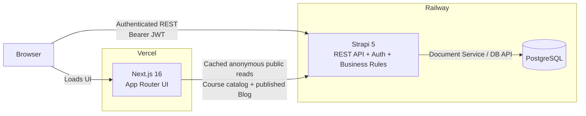
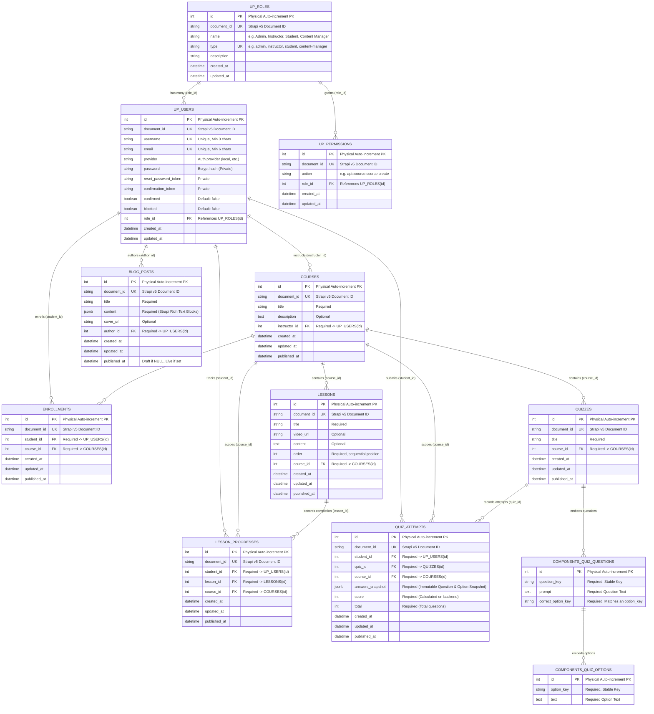

# CPS Academy — System & Domain Architecture

**Status:** As-built architecture  
**Last updated:** 2026-08-31  
**Scope:** Full-stack CPS Academy LMS  
**Stack:** Next.js 16 · React 19 · TypeScript · Strapi 5 · PostgreSQL  
**Hosting:** Vercel (frontend) · Railway (Strapi + PostgreSQL)

---

## 1. Purpose

This document describes the final system shape of CPS Academy: where responsibilities live, how the frontend and backend communicate, and how the main LMS entities relate to each other.

It is intentionally an **as-built** document. It describes the implementation that exists in the repository rather than earlier design alternatives.

The architecture follows one central rule:

> **The browser may present state, but Strapi owns every security-sensitive and business-critical decision.**

Authentication, LMS roles, resource ownership, enrollment identity, lesson sequencing, progress calculation, quiz grading, role changes, and Blog publication rules are enforced by the backend.

---

## 2. System Overview

CPS Academy has three runtime layers:

1. **Next.js frontend** on Vercel.
2. **Strapi REST API** on Railway.
3. **PostgreSQL** on Railway.



### 2.1 Public request path

Anonymous Course and Blog reads may run through Next.js Server Components:

```text
Browser
  ↓
Next.js Server Component
  ↓
publicApiRequest()
  ↓
Strapi public endpoint
  ↓
60-second revalidated cache
```

The cached public boundary is restricted to public Course catalog/detail and published Blog list/detail reads. It never carries a JWT.

### 2.2 Authenticated request path

Authenticated LMS operations go directly from the browser to Strapi:

```text
Browser Client Component
  ↓
apiRequest()
Authorization: Bearer <JWT>
cache: no-store
  ↓
Strapi
  ↓
PostgreSQL
```

This path is used for enrollment, learning, progress, quiz attempts, course management, Blog management, Admin operations, and authenticated identity.

---

## 3. Responsibility Boundaries

### Next.js

Next.js owns:

- rendering and responsive UI;
- App Router navigation;
- form interaction and local UI state;
- session restoration in the browser;
- UX-level route/role guards;
- endpoint-specific response parsing;
- anonymous public read caching;
- presentation of backend-derived progress, scores, permissions, and status.

Next.js does **not** decide:

- whether an Instructor owns a Course;
- whether a Student is enrolled;
- whether a Lesson is unlocked;
- whether a Lesson is complete;
- what a Course progress percentage is;
- which Quiz answer is correct;
- what score a Quiz receives;
- whether a user may change another user's role;
- whether a Blog draft may be managed or viewed publicly.

### Strapi

Strapi owns:

- registration and login through Users & Permissions;
- JWT authentication;
- LMS role provisioning and action permissions;
- resource-level ownership;
- server-controlled identities and relations;
- Course/Lesson/Quiz authoring rules;
- Enrollment;
- Lesson sequencing;
- Lesson completion;
- Course progress;
- Quiz sanitization and grading;
- QuizAttempt persistence;
- Admin role management and statistics;
- Blog ownership and Draft & Publish;
- dependency/deletion guards;
- persistence through PostgreSQL.

### PostgreSQL

PostgreSQL stores the durable application state. Strapi is the only application layer with database access.

---

## 4. Identity Model

CPS Academy deliberately uses **one application-user system** for all four LMS roles: Strapi's Users & Permissions plugin.

The LMS roles are:

- **Admin**
- **Content Manager**
- **Instructor**
- **Student**

The Strapi **Super Admin** account used at `/admin` is an infrastructure/operator identity and is separate from the CPS Academy LMS Admin role.

Public registration defaults to **Student**. Elevated application roles are assigned through the LMS Admin flow.

---

## 5. Logical Domain Model

The following is a **logical domain ER diagram** depicting core entities, authentication relations, and course hierarchy in Strapi 5 and PostgreSQL:



`COMPONENTS_QUIZ_QUESTIONS` and `COMPONENTS_QUIZ_OPTIONS` above represent **Strapi components embedded inside Quiz**, not independently addressable top-level Content API resources.

---

## 6. Entity Responsibilities

### 6.1 User and Role

`plugin::users-permissions.user` is extended with inverse relations to:

- Courses instructed by the user;
- Student Enrollments;
- LessonProgress records;
- QuizAttempts;
- authored BlogPosts.

The built-in U&P Role relation is the source of the LMS role.

### 6.2 Course

A Course contains:

- `title`
- optional `description`
- required Instructor relation

A Course has many:

- Lessons
- Quizzes
- Enrollments
- LessonProgress records
- QuizAttempts

The Instructor relation is the root of Instructor ownership.

### 6.3 Lesson

A Lesson contains:

- `title`
- optional text `content`
- optional `videoUrl`
- positive integer `order`
- required Course relation

Lesson order is meaningful inside its Course and drives sequential learning.

### 6.4 Enrollment

Enrollment relates exactly one Student to one Course.

The Student relation is always derived from the authenticated user for Student enrollment operations. The browser is not allowed to choose a Student identity.

The application treats `(student, course)` as a uniqueness invariant.

### 6.5 LessonProgress

LessonProgress relates:

- Student
- Lesson
- Course

There is no mutable `completed` boolean in the final model.

> **Existence of a valid LessonProgress record means that the Student completed that Lesson.**

This makes completion an event/fact rather than a second mutable state that could disagree with the relation.

The application treats `(student, lesson)` as unique.

### 6.6 Quiz

A Quiz belongs directly to a Course and contains:

- `title`
- repeatable `quiz.question` components

A Question contains:

- stable `questionKey`
- `prompt`
- repeatable `quiz.option` components
- `correctOptionKey`

An Option contains:

- stable `optionKey`
- `text`

The correct answer is stored on the Question, not on a client-facing Option flag.

### 6.7 QuizAttempt

A QuizAttempt relates:

- Student
- Quiz
- Course

and stores:

- `score`
- `total`
- `answersSnapshot`

Multiple attempts are allowed.

`answersSnapshot` preserves the Question/Option context, selected answer, correct answer, and correctness used when the attempt was graded. That protects historical meaning if the authored Quiz changes later.

### 6.8 BlogPost

BlogPost contains:

- `title`
- Strapi Blocks `content`
- optional `coverUrl`
- required author relation

Draft & Publish is enabled.

The public Blog endpoints expose only published versions. Admin and Content Manager use management actions for draft/publish workflow.

---

## 7. Core Domain Invariants

The backend preserves these rules regardless of what the frontend displays.

### Identity and access

- Student identity comes from the authenticated JWT, never from a request-body Student ID.
- Only Admin may manage LMS user roles and platform statistics.
- Content Manager may manage platform content but not application users.
- Instructor may manage only resources belonging to their own Courses.
- Frontend role guards are UX only; backend authorization is authoritative.

### Course and authoring

- Every Course has an Instructor.
- Instructor-created Courses are self-owned.
- Admin/Content Manager may assign a valid Instructor when creating/reassigning a Course.
- Instructor cannot reassign Course ownership.
- Lesson and Quiz Course relations are immutable after creation.
- Lesson order must be a positive integer.
- Lesson order must be unique inside a Course.

### Enrollment and learning

- A Student may not create duplicate Enrollment state for the same Course.
- A Student must be enrolled before accessing protected learning/progress/Quiz operations.
- A later Lesson is unavailable until all existing lower-order Lessons are complete.
- Sequence enforcement exists on the backend even when the frontend already displays a Lesson as locked.

### Progress

- Completion is represented by LessonProgress existence.
- Re-completing an already completed Lesson is idempotent.
- Progress is derived from the **current** Course Lessons and valid Student LessonProgress records.
- A Course with zero Lessons reports `0%`.
- The percentage is:

```text
round(completedLessons / totalLessons × 100)
```

### Quiz

- Student-facing Quiz reads do not expose `correctOptionKey`.
- Quiz submission accepts only Question keys and selected Option keys.
- Client-supplied score/correctness data is never trusted.
- Selected Option keys must belong to the corresponding Question.
- Exactly one valid answer is required for every Question.
- Score and total are computed on the server.
- Every persisted attempt stores a historical answer snapshot.

### Admin

- The last remaining LMS Admin cannot be demoted.
- An Instructor who still owns Courses cannot have the Instructor role removed until those Courses are reassigned.

### Deletion consistency

- A Course cannot be hard-deleted while dependent Course data exists.
- A Lesson cannot be deleted while LessonProgress references it.
- A Quiz cannot be deleted while QuizAttempt records reference it.

These guards prevent silent destruction of Student history.

---

## 8. Public vs Private Data

Public API shapes are intentionally small.

### Public Course catalog

Public Course responses expose only catalog information such as:

- Course `documentId`
- title
- description
- Instructor username

Course detail adds syllabus Lesson order/title.

They do **not** expose:

- Lesson content
- Lesson video URLs
- Quiz correctness data
- private Student data

### Public Blog

Only published Blog versions are returned.

### Private data

The following remain authenticated and uncached:

- `/api/me`
- Enrollments
- Lesson learning
- Course progress
- Quiz taking/submission/history
- Course management
- Student progress reporting
- Admin users/stats/role changes
- Blog management and mutations

---

## 9. Deployment Topology

### Vercel

Hosts the Next.js application.

Required public frontend configuration:

```env
NEXT_PUBLIC_STRAPI_URL=https://<railway-backend-host>
```

### Railway

Hosts:

- Strapi backend
- PostgreSQL database

Backend environment configuration includes variable **names** such as:

```text
APP_KEYS
API_TOKEN_SALT
ADMIN_JWT_SECRET
TRANSFER_TOKEN_SALT
ENCRYPTION_KEY
JWT_SECRET
DATABASE_URL / database connection settings
FRONTEND_URL
```

Secret values are deployment-only and are not part of the repository.

`FRONTEND_URL` controls allowed CORS origins. Koa proxy trust is enabled because Railway terminates HTTPS before the Strapi application.

---

## 10. Architectural Summary

CPS Academy intentionally separates presentation from authority:

```text
Next.js
  presentation
  interaction
  UX guards
  public read caching
        ↓
Strapi
  authentication
  authorization
  ownership
  validation
  progress
  grading
  persistence rules
        ↓
PostgreSQL
  durable state
```

The most important architectural decisions are:

1. one U&P identity system for all LMS users;
2. backend-enforced role and resource ownership;
3. server-derived Enrollment identity and progress;
4. LessonProgress-as-completion rather than mutable percentages;
5. sequential learning enforced on the backend;
6. Quiz answer keys excluded from Student reads;
7. authoritative server-side Quiz grading with historical snapshots;
8. a strict split between cacheable anonymous reads and uncached authenticated data.

---

## 11. Implementation References

Key repository locations:

```text
backend/src/extensions/users-permissions/content-types/user/schema.json
backend/src/api/course/content-types/course/schema.json
backend/src/api/lesson/content-types/lesson/schema.json
backend/src/api/enrollment/content-types/enrollment/schema.json
backend/src/api/lesson-progress/content-types/lesson-progress/schema.json
backend/src/api/quiz/content-types/quiz/schema.json
backend/src/components/quiz/question.json
backend/src/components/quiz/option.json
backend/src/api/quiz-attempt/content-types/quiz-attempt/schema.json
backend/src/api/blog-post/content-types/blog-post/schema.json

backend/src/utils/provisioning.ts
backend/src/api/lesson-progress/controllers/lesson-progress.ts
backend/src/api/lesson-progress/utils/progress.ts
backend/src/api/quiz-attempt/controllers/quiz-attempt.ts
backend/src/api/quiz-attempt/utils/quiz.ts

frontend/src/lib/api/request.ts
frontend/src/features/auth/storage.ts
frontend/src/features/auth/AuthProvider.tsx
frontend/src/app/courses/page.tsx
frontend/src/features/courses/public-course-catalog.tsx
```
