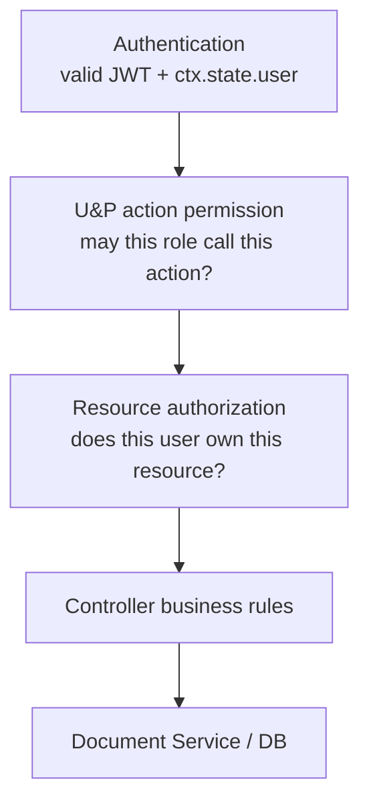

# CPS Academy — Backend Architecture

**Status:** As-built architecture  
**Last updated:** 2026-08-31  
**Runtime:** Strapi 5 + TypeScript + PostgreSQL  
**Hosting:** Railway

---

## 1. Backend Goals

The CPS Academy backend is designed around four requirements:

1. **Every privileged action is authorized on the backend.**
2. **The browser cannot choose security-sensitive identity or derived values.**
3. **Progress and grading are server-authoritative.**
4. **Student history remains internally consistent under retries, concurrent requests, edits, and deletes.**

Strapi is used as both the application API and the content-management framework, but the LMS business rules are implemented explicitly where native Content API permissions are not sufficient.

---

## 2. Authentication and LMS Identity

Authentication uses Strapi's **Users & Permissions** plugin.

All four LMS personas are U&P users:

- Admin
- Content Manager
- Instructor
- Student

The Strapi `/admin` Super Admin account is separate from the LMS Admin role.

### 2.1 Authenticated user helper

`backend/src/utils/auth.ts` centralizes:

- the four LMS role names;
- safe extraction of authenticated U&P user ID;
- safe extraction of the U&P role name;
- a small `unknown` record guard used at request boundaries.

Controllers and policies use `ctx.state.user` as the authenticated source.

### 2.2 Current-user endpoint

`GET /api/me` reloads the database user and returns only:

```json
{
  "data": {
    "user": {
      "id": 1,
      "username": "example",
      "email": "example@example.com",
      "role": "Student"
    }
  }
}
```

If the U&P role is not one of the four LMS roles, the outward LMS role is `null`.

This endpoint is the frontend's authoritative identity check after loading a stored JWT.

### 2.3 Instructor directory

`GET /api/instructors` is available only to:

- Admin
- Content Manager

It returns a deliberately small shape:

```json
{
  "data": {
    "instructors": [
      {
        "id": 12,
        "username": "instructor-name"
      }
    ]
  }
}
```

No email or generic User-read permission is exposed just to populate a Course assignment selector.

---

## 3. Permission Provisioning

CPS Academy does not rely on hand-configuring a production Strapi instance.

`backend/src/utils/provisioning.ts` runs during Strapi bootstrap and:

1. validates that every expected Content API action exists in the U&P action registry;
2. creates the four LMS roles if missing;
3. loads role IDs;
4. creates permissions required by the declared matrix;
5. removes permissions that are no longer part of that matrix;
6. sets the U&P registration default role to `student`.

The bootstrap entry point is:

```text
backend/src/index.ts
  ↓
bootstrap()
  ↓
provisionRolesAndPermissions(strapi)
```

This makes role/action configuration reproducible across local and Railway environments.

---

## 4. Authorization Model

Authorization is deliberately layered.



### 4.1 Layer 1 — authentication

Protected operations require a valid authenticated U&P user.

Missing/invalid authentication results in Unauthorized behavior.

### 4.2 Layer 2 — action-level RBAC

The provisioning matrix decides whether a role may invoke a controller action at all.

Examples:

- Admin receives user-management and stats actions.
- Admin and Content Manager receive Blog management.
- Admin, Content Manager, and Instructor receive Course/Lesson/Quiz authoring actions.
- Student receives Enrollment, learning, progress, Quiz take/submit/history.
- Public receives only intended anonymous endpoints such as Course catalog and published Blog reads.

### 4.3 Layer 3 — resource-level ownership

Role permission alone cannot express “Instructor may edit a Course, but only their own Course.”

CPS Academy therefore uses route policies and controller-level ownership checks.

#### Course update/delete

Core Course routes attach:

```text
api::course.is-course-owner
```

Admin and Content Manager pass automatically.

Instructor must match `course.instructor.id`.

#### Lesson update/delete

Lesson routes attach:

```text
api::lesson.is-lesson-course-owner
```

The policy resolves Lesson → Course and verifies Course ownership.

#### Quiz update/delete

Quiz routes attach:

```text
api::quiz.is-quiz-course-owner
```

The policy resolves Quiz → Course and verifies Course ownership.

#### Create/list/manage operations

Create and management controllers also derive/filter ownership from the authenticated user. For example, an Instructor management list is filtered by `instructor.id = authenticated user.id`.

This gives two complementary protections:

> **RBAC answers what kind of action a role may perform. Ownership answers which specific record the authenticated user may perform it on.**

---

## 5. Course Management

### 5.1 Public catalog

The public Course catalog uses fixed, safe response shapes.

List fields:

- `documentId`
- `title`
- `description`
- Instructor username

Detail additionally exposes:

- syllabus Lesson `order`
- syllabus Lesson `title`

Public Course detail does not expose Lesson body/video or Quiz answer data.

### 5.2 Management list

`GET /api/courses/manage` returns:

- all Courses for Admin/Content Manager;
- only authenticated Instructor-owned Courses for Instructor.

### 5.3 Course creation

Allowed roles:

- Admin
- Content Manager
- Instructor

Writable content is allowlisted to Course fields.

Ownership behavior:

- Instructor-created Course → Instructor relation comes from authenticated user.
- Admin/Content Manager → supplied Instructor must resolve to a valid Instructor user.

### 5.4 Course update

Instructor cannot submit an Instructor reassignment.

Admin/Content Manager may reassign ownership to a validated Instructor.

Course update/delete also pass through the Course ownership policy, so an Instructor cannot update another Instructor's record by calling the API directly.

### 5.5 Course delete guard

A Course hard delete is blocked if dependent records exist, including:

- Lesson
- Quiz
- Enrollment
- LessonProgress
- QuizAttempt

This protects Student history and prevents orphaned domain state.

---

## 6. Lesson Management

Lesson authoring supports:

- title
- content
- optional video URL
- order
- Course relation at creation

### 6.1 Order rules

`order` must:

- be an integer;
- be at least 1;
- be unique inside the Course.

Course-level locking is used when creating/updating order-sensitive Lesson state to reduce race conditions around duplicate order checks.

### 6.2 Ownership

Instructor may create a Lesson only in an owned Course.

Admin/Content Manager may create in any valid Course.

Update/delete routes use the Lesson→Course ownership policy.

### 6.3 Course relation immutability

Once created, a Lesson cannot be moved to another Course.

This keeps Enrollment/progress/sequence meaning stable.

### 6.4 Delete guard

A Lesson cannot be hard-deleted while LessonProgress records reference it.

---

## 7. Enrollment

Student enrollment is a custom operation because generic CRUD would allow the browser to choose relations that must be server-controlled.

### 7.1 Request contract

The route identifies the Course:

```text
POST /api/courses/:courseDocumentId/enroll
```

The Student comes from `ctx.state.user`.

The controller explicitly rejects client attempts to supply Student or Course relation fields in the body.

### 7.2 Transaction flow

Enrollment runs inside a transaction.

Conceptually:

```text
authenticated Student
  ↓
lock Student
  ↓
lock/check Course
  ↓
find Enrollment(student, course)
  ├─ exists → return existing Enrollment
  └─ missing → create Enrollment
```

Duplicate enrollment therefore behaves idempotently instead of creating duplicate domain state.

### 7.3 My enrollments

`GET /api/enrollments/me` always filters by the authenticated Student ID.

The browser never supplies another Student ID.

---

## 8. Sequential Learning

The sequential-learning rule is:

> A Student may access/complete Lesson N only when every existing Lesson in the same Course with a lower `order` is complete.

Gaps are allowed. For example, Lesson orders `1, 3, 10` are valid; Lesson `10` requires the lower existing Lessons `1` and `3`, not nonexistent numbers.

### 8.1 Student learning endpoints

```text
GET  /api/courses/:courseDocumentId/lessons
GET  /api/lessons/:lessonDocumentId/learn
POST /api/lessons/:lessonDocumentId/complete
GET  /api/courses/:courseDocumentId/progress
```

### 8.2 Enrollment check

Protected learning operations call a server-side Enrollment check. Guessing a valid Lesson or Course document ID does not grant access.

### 8.3 Locked Lesson responses

The Course Lesson listing computes whether each Lesson is locked.

For locked Lessons, protected content such as Lesson body/video is not returned.

This means the frontend's lock icon is not the only control.

---

## 9. Persistent Progress

Progress is intentionally not stored as a mutable percentage.

### 9.1 Completion model

A valid LessonProgress document connecting:

- Student
- Lesson
- Course

is the completion fact.

There is no final-model `completed` boolean.

### 9.2 Completion request

`POST /api/lessons/:lessonDocumentId/complete`:

1. reads Student identity from authenticated state;
2. rejects client-controlled completion/progress fields;
3. resolves the Lesson and Course;
4. verifies Enrollment;
5. loads authoritative Course completion state;
6. checks whether the Lesson is already complete;
7. validates lower-order prerequisites;
8. creates LessonProgress when necessary;
9. recalculates progress;
10. returns the authoritative result.

Client-controlled fields rejected include concepts such as:

```text
student
lesson
course
completed
percentage
score
progress
```

### 9.3 Transaction and locking

Completion runs in a DB transaction and uses row locking around the Student/Course/Lesson write path.

The goal is to make concurrent “complete” requests safe rather than assuming the frontend will only send one request.

### 9.4 Authoritative completion state

`getCourseCompletionState()`:

1. loads the **current** Course Lessons;
2. validates each Lesson's order;
3. builds the current Lesson ID set;
4. loads Student LessonProgress rows for those Lesson IDs;
5. accepts only records whose Lesson is still in the Course and whose stored Course relation matches;
6. returns total current Lessons plus the completed Lesson ID set.

A Course relation alone is not accepted as proof of valid progress.

### 9.5 Percentage

```text
completedLessons
totalLessons
percentage
```

are derived server-side.

Formula:

```text
totalLessons == 0
  ? 0
  : round(completedLessons / totalLessons * 100)
```

This ensures that:

- progress survives refresh/login;
- progress is per Student and per Course;
- adding/removing current Course Lessons changes the denominator correctly;
- zero-Lesson Courses do not produce NaN/divide-by-zero.

### 9.6 Staff progress

`GET /api/courses/:courseDocumentId/students-progress`

Allowed:

- Admin → any Course
- Content Manager → any Course
- Instructor → own Course only

The endpoint derives each enrolled Student's progress using the same authoritative progress utility.

---

## 10. Quiz Authoring Model

Quiz belongs directly to Course.

It embeds repeatable Question components. Each Question embeds repeatable Option components.

```text
Quiz
 └─ Question
     ├─ questionKey
     ├─ prompt
     ├─ correctOptionKey
     └─ Options[]
          ├─ optionKey
          └─ text
```

Stable keys are used instead of depending on array positions.

### Authoring rules

Admin/Content Manager may manage Quizzes broadly.

Instructor may manage Quizzes only in owned Courses.

Quiz Course relation cannot be changed after creation.

Quiz hard delete is blocked once QuizAttempts exist.

---

## 11. Student Quiz Security

The Quiz subsystem intentionally separates the **Student view** from the **authoritative grading view**.

### 11.1 Take Quiz

```text
GET /api/quizzes/:quizDocumentId/take
```

The Student must be enrolled in the Quiz's Course.

The query returns:

- Quiz document ID/title;
- Question key/prompt;
- Option key/text.

It does **not** select or return `correctOptionKey`.

> Hiding the answer key in React would not be security. The answer key is excluded before the response leaves Strapi.

### 11.2 Submission contract

```text
POST /api/quizzes/:quizDocumentId/submit
```

Body:

```json
{
  "answers": [
    {
      "questionKey": "q1",
      "selectedOptionKey": "q1-a"
    }
  ]
}
```

The body parser rejects:

- extra top-level fields;
- extra answer fields;
- blank keys;
- duplicate Question keys.

Student identity, score, correctness, Course, and QuizAttempt relations are server-controlled.

### 11.3 Authoritative grading

On submit, the backend:

1. verifies Student identity;
2. validates the submitted answer shape;
3. locks the Quiz against destructive concurrent change while the attempt is created;
4. checks Enrollment;
5. reloads the authoritative Quiz with `correctOptionKey`;
6. validates the authored Question structure;
7. requires exactly one answer for every Question;
8. confirms the selected Option belongs to its Question;
9. compares selected vs correct Option key;
10. counts correct Questions;
11. stores the QuizAttempt.

The score is:

```text
number of Questions where
selectedOptionKey == correctOptionKey
```

`total` is the Question count.

### 11.4 Historical snapshot

Each attempt stores `answersSnapshot`.

The snapshot includes enough context to explain the attempt later, including:

- Question key/prompt;
- options;
- selected Option;
- correct Option;
- correctness.

Therefore a later edit to the Quiz does not silently rewrite the historical meaning of an older attempt.

### 11.5 Attempt history

```text
GET /api/quizzes/:quizDocumentId/attempts/me
```

returns only the authenticated Student's attempts for that enrolled Quiz.

Multiple attempts are supported.

---

## 12. Admin Architecture

Admin functionality is implemented as application APIs rather than relying on the Strapi operator panel.

### 12.1 Admin-only gate

Admin user-management and stats controller actions call a shared `requireAdmin()` guard.

A non-Admin authenticated user is rejected even if they manually call the endpoint.

### 12.2 User list

The Admin user list returns a restricted application shape:

- ID
- username
- email
- LMS role or `null`

### 12.3 Role change

Role-change request accepts only:

```json
{
  "role": "Student"
}
```

or another valid LMS role / `null`.

The browser does not submit an arbitrary U&P role record ID.

The backend resolves the target role by configured role type.

### 12.4 Instructor demotion guard

If a target user is currently an Instructor and still owns at least one Course, the role change is rejected.

Courses must be reassigned first.

### 12.5 Last-Admin guard

Before demoting an Admin, the backend counts LMS Admin users.

If this would remove the final Admin, the change is rejected.

### 12.6 Statistics

The Admin stats endpoint loads:

- Users;
- Course count;
- Enrollment count

and derives:

- total users;
- user totals by LMS role;
- total Courses;
- total Enrollments.

Independent queries are loaded in parallel.

---

## 13. Blog Architecture

BlogPost uses Strapi's native Draft & Publish feature with custom application authorization around it.

### 13.1 Writers

Only:

- Admin
- Content Manager

may manage Blog posts.

### 13.2 Write allowlist

Blog mutation bodies may write:

- title
- Blocks content
- cover URL

Publication state and author identity are not arbitrary client-controlled fields.

### 13.3 Ownership

Admin may manage all Blog posts.

Content Manager may manage only Blog posts whose author matches the authenticated Content Manager.

### 13.4 Draft creation

New Blog posts are created as draft documents.

### 13.5 Explicit publication actions

Publishing and unpublishing are explicit actions using Strapi Document Service operations.

The public Blog list/detail queries explicitly request published content.

### 13.6 Public visibility

Public endpoints return only published Blog versions.

Drafts remain in the management surface.

---

## 14. Data Consistency and Defensive Rules

The backend uses several techniques beyond basic CRUD.

### Transactions and locks

Used where concurrent requests can affect invariants, including:

- Enrollment;
- Lesson completion;
- Lesson order-sensitive mutations;
- Quiz submission/deletion interaction;
- Course/Lesson/Quiz deletion paths.

### Allowlisted writes

Controllers construct writable data rather than forwarding arbitrary request bodies.

### Immutable parent relations

Lesson and Quiz cannot be moved between Courses after creation.

### Dependency-aware deletes

Student history prevents destructive deletes where appropriate.

### Safe response shapes

Public endpoints and specialized identity directories deliberately select only fields required by the frontend.

---

## 15. API Capability Summary

| Capability | Endpoint / action | Access |
|---|---|---|
| Current LMS user | `GET /api/me` | authenticated |
| Instructor directory | `GET /api/instructors` | Admin, Content Manager |
| Public Course catalog | `GET /api/catalog/courses` | public |
| Public Course detail | `GET /api/catalog/courses/:id` | public |
| Managed Courses | `GET /api/courses/manage` | Admin, Content Manager, Instructor-own |
| Enroll | `POST /api/courses/:id/enroll` | Student |
| My Enrollments | `GET /api/enrollments/me` | Student |
| Course Lessons | `GET /api/courses/:id/lessons` | enrolled Student |
| Learn Lesson | `GET /api/lessons/:id/learn` | enrolled + sequence-valid Student |
| Complete Lesson | `POST /api/lessons/:id/complete` | enrolled + sequence-valid Student |
| Own Course progress | `GET /api/courses/:id/progress` | Student |
| Student progress report | `GET /api/courses/:id/students-progress` | Admin, CM, Instructor-own |
| Course Quizzes | `GET /api/courses/:id/quizzes` | enrolled Student |
| Take Quiz | `GET /api/quizzes/:id/take` | enrolled Student |
| Submit Quiz | `POST /api/quizzes/:id/submit` | enrolled Student |
| My Quiz attempts | `GET /api/quizzes/:id/attempts/me` | enrolled Student |
| Admin users | `GET /api/admin/users` | Admin |
| Change role | `PATCH /api/admin/users/:userId/role` | Admin |
| Admin stats | `GET /api/admin/stats` | Admin |
| Published Blog | `GET /api/blog` | public |
| Published Blog detail | `GET /api/blog/:documentId` | public |
| Manage Blog | `GET /api/blog/manage` + mutations | Admin, Content Manager |

Core Course/Lesson/Quiz CRUD is also protected by U&P permissions plus ownership policies.

---

## 16. Deployment and Environment

Strapi runs on Railway with PostgreSQL.

Important configuration principles:

- production DB settings come from environment variables;
- secret values are not committed;
- CORS origins come from `FRONTEND_URL`;
- Koa proxy trust is enabled for Railway HTTPS termination;
- frontend API origin is supplied independently to Vercel.

Never expose in documentation:

- real JWT secrets;
- Admin JWT secret;
- API/transfer salts;
- encryption key;
- database password.

---

## 17. Backend Design Summary

The backend uses Strapi native features where they fit and custom code where the LMS needs stronger guarantees.

**Strapi-native foundations:**

- Users & Permissions authentication;
- role/action registry;
- Content Types and relations;
- Document Service;
- Draft & Publish;
- sanitization helpers.

**Custom LMS rules:**

- reproducible role provisioning;
- Instructor ownership;
- safe Instructor directory;
- server-controlled Enrollment identity;
- sequential Lessons;
- persistent server-derived progress;
- safe Student Quiz representation;
- auto-grading;
- historical QuizAttempt snapshots;
- Admin role invariants;
- Blog ownership;
- dependency-aware deletes.

This keeps the system small enough for the assignment while ensuring the frontend cannot bypass the rules that matter.

---

## 18. Implementation References

```text
backend/src/index.ts
backend/src/utils/auth.ts
backend/src/utils/provisioning.ts

backend/src/api/application-user/controllers/application-user.ts
backend/src/api/application-admin/controllers/application-admin.ts

backend/src/api/course/controllers/course.ts
backend/src/api/course/routes/course.ts
backend/src/api/course/policies/is-course-owner.ts

backend/src/api/lesson/controllers/lesson.ts
backend/src/api/lesson/routes/lesson.ts
backend/src/api/lesson/policies/is-lesson-course-owner.ts

backend/src/api/enrollment/controllers/enrollment.ts

backend/src/api/lesson-progress/routes/01-student-progress.ts
backend/src/api/lesson-progress/controllers/lesson-progress.ts
backend/src/api/lesson-progress/utils/progress.ts

backend/src/api/quiz/controllers/quiz.ts
backend/src/api/quiz/routes/quiz.ts
backend/src/api/quiz/policies/is-quiz-course-owner.ts

backend/src/api/quiz-attempt/routes/01-student-quiz.ts
backend/src/api/quiz-attempt/controllers/quiz-attempt.ts
backend/src/api/quiz-attempt/utils/quiz.ts

backend/src/api/blog-post/controllers/blog-post.ts

backend/config/middlewares.ts
backend/config/server.ts
backend/config/database.ts
```
