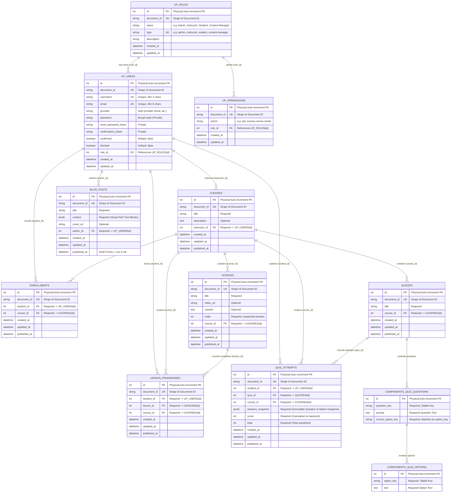

```mermaid
erDiagram
    %% ==========================================
    %% CORE AUTHENTICATION & ACCESS CONTROL (U&P)
    %% ==========================================
    UP_ROLES ||--o{ UP_USERS : "has many (role_id)"
    UP_ROLES ||--o{ UP_PERMISSIONS : "grants (role_id)"

    %% ==========================================
    %% USER RELATIONS ACROSS THE DOMAIN
    %% ==========================================
    UP_USERS ||--o{ COURSES : "instructs (instructor_id)"
    UP_USERS ||--o{ ENROLLMENTS : "enrolls (student_id)"
    UP_USERS ||--o{ LESSON_PROGRESSES : "tracks (student_id)"
    UP_USERS ||--o{ QUIZ_ATTEMPTS : "submits (student_id)"
    UP_USERS ||--o{ BLOG_POSTS : "authors (author_id)"

    %% ==========================================
    %% COURSE HIERARCHY & PROGRESSION
    %% ==========================================
    COURSES ||--o{ LESSONS : "contains (course_id)"
    COURSES ||--o{ QUIZZES : "contains (course_id)"
    COURSES ||--o{ ENROLLMENTS : "has (course_id)"
    COURSES ||--o{ LESSON_PROGRESSES : "scopes (course_id)"
    COURSES ||--o{ QUIZ_ATTEMPTS : "scopes (course_id)"

    %% ==========================================
    %% LESSON & PROGRESS TRACKING
    %% ==========================================
    LESSONS ||--o{ LESSON_PROGRESSES : "records completion (lesson_id)"

    %% ==========================================
    %% QUIZ & AUTO-GRADING ENGINE
    %% ==========================================
    QUIZZES ||--o{ QUIZ_ATTEMPTS : "records attempts (quiz_id)"
    QUIZZES ||--o{ COMPONENTS_QUIZ_QUESTIONS : "embeds questions"
    COMPONENTS_QUIZ_QUESTIONS ||--o{ COMPONENTS_QUIZ_OPTIONS : "embeds options"

    %% ==========================================
    %% ENTITY DEFINITIONS & ATTRIBUTES
    %% ==========================================
    UP_USERS {
        int id PK "Physical Auto-increment PK"
        string document_id UK "Strapi v5 Document ID"
        string username UK "Unique, Min 3 chars"
        string email UK "Unique, Min 6 chars"
        string provider "Auth provider (local, etc.)"
        string password "Bcrypt hash (Private)"
        string reset_password_token "Private"
        string confirmation_token "Private"
        boolean confirmed "Default: false"
        boolean blocked "Default: false"
        int role_id FK "References UP_ROLES(id)"
        datetime created_at
        datetime updated_at
    }

    UP_ROLES {
        int id PK "Physical Auto-increment PK"
        string document_id UK "Strapi v5 Document ID"
        string name "e.g. Admin, Instructor, Student, Content Manager"
        string type UK "e.g. admin, instructor, student, content-manager"
        string description
        datetime created_at
        datetime updated_at
    }

    UP_PERMISSIONS {
        int id PK "Physical Auto-increment PK"
        string document_id UK "Strapi v5 Document ID"
        string action "e.g. api::course.course.create"
        int role_id FK "References UP_ROLES(id)"
        datetime created_at
        datetime updated_at
    }

    COURSES {
        int id PK "Physical Auto-increment PK"
        string document_id UK "Strapi v5 Document ID"
        string title "Required"
        text description "Optional"
        int instructor_id FK "Required -> UP_USERS(id)"
        datetime created_at
        datetime updated_at
        datetime published_at
    }

    LESSONS {
        int id PK "Physical Auto-increment PK"
        string document_id UK "Strapi v5 Document ID"
        string title "Required"
        string video_url "Optional"
        text content "Optional"
        int order "Required, sequential position"
        int course_id FK "Required -> COURSES(id)"
        datetime created_at
        datetime updated_at
        datetime published_at
    }

    ENROLLMENTS {
        int id PK "Physical Auto-increment PK"
        string document_id UK "Strapi v5 Document ID"
        int student_id FK "Required -> UP_USERS(id)"
        int course_id FK "Required -> COURSES(id)"
        datetime created_at
        datetime updated_at
        datetime published_at
    }

    LESSON_PROGRESSES {
        int id PK "Physical Auto-increment PK"
        string document_id UK "Strapi v5 Document ID"
        int student_id FK "Required -> UP_USERS(id)"
        int lesson_id FK "Required -> LESSONS(id)"
        int course_id FK "Required -> COURSES(id)"
        datetime created_at
        datetime updated_at
        datetime published_at
    }

    QUIZZES {
        int id PK "Physical Auto-increment PK"
        string document_id UK "Strapi v5 Document ID"
        string title "Required"
        int course_id FK "Required -> COURSES(id)"
        datetime created_at
        datetime updated_at
        datetime published_at
    }

    COMPONENTS_QUIZ_QUESTIONS {
        int id PK "Physical Auto-increment PK"
        string question_key "Required, Stable Key"
        text prompt "Required Question Text"
        string correct_option_key "Required, Matches an option_key"
    }

    COMPONENTS_QUIZ_OPTIONS {
        int id PK "Physical Auto-increment PK"
        string option_key "Required, Stable Key"
        text text "Required Option Text"
    }

    QUIZ_ATTEMPTS {
        int id PK "Physical Auto-increment PK"
        string document_id UK "Strapi v5 Document ID"
        int student_id FK "Required -> UP_USERS(id)"
        int quiz_id FK "Required -> QUIZZES(id)"
        int course_id FK "Required -> COURSES(id)"
        jsonb answers_snapshot "Required (Immutable Question & Option Snapshot)"
        int score "Required (Calculated on backend)"
        int total "Required (Total questions)"
        datetime created_at
        datetime updated_at
        datetime published_at
    }

    BLOG_POSTS {
        int id PK "Physical Auto-increment PK"
        string document_id UK "Strapi v5 Document ID"
        string title "Required"
        jsonb content "Required (Strapi Rich Text Blocks)"
        string cover_url "Optional"
        int author_id FK "Required -> UP_USERS(id)"
        datetime created_at
        datetime updated_at
        datetime published_at "Draft if NULL, Live if set"
    }
```
